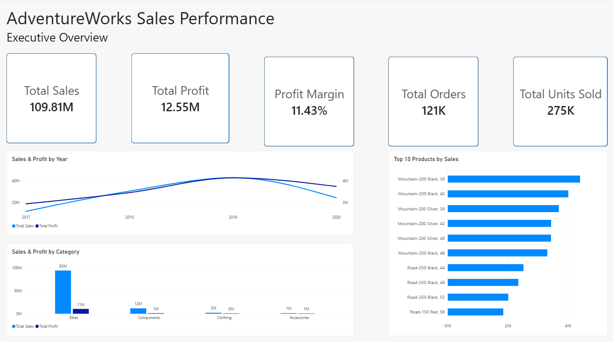
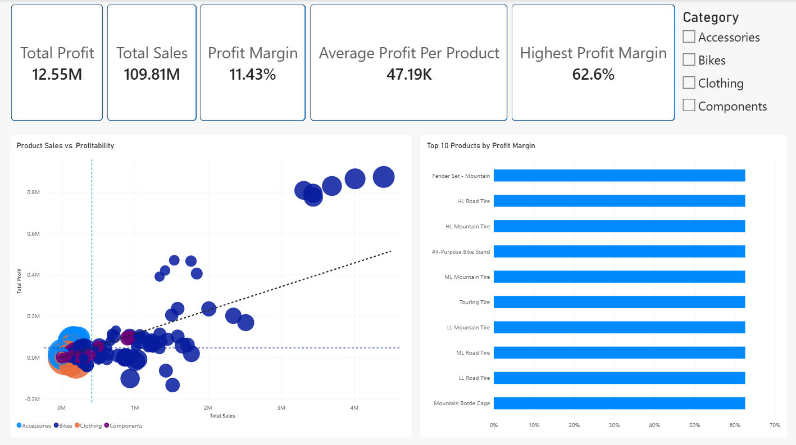
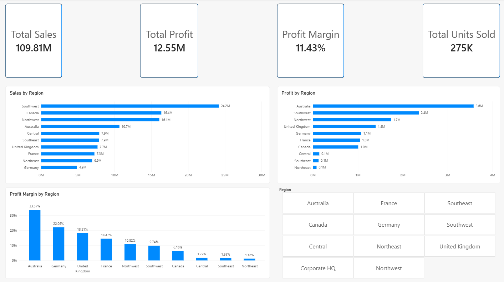

# AdventureWorks Sales Performance Dashboard

## Project Overview

I challenged myself to learn Power BI and build an end-to-end business analytics dashboard in one day.

Using the AdventureWorks sales dataset, I developed a 5-page interactive dashboard analyzing **$109.8M in sales and $12.6M in profit** across products, categories, and sales regions.

The goal of the project was to transform raw sales data into an interactive business intelligence tool that could help decision-makers understand revenue, profitability, product performance, and regional performance.

## Tools & Skills

- Power BI
- DAX
- Data Modeling
- Data Visualization
- Business Analytics
- Profitability Analysis
- KPI Development
- Interactive Slicers & Dashboards

## Dashboard Pages

### 1. Executive Overview

Provides a high-level view of overall business performance, including total sales, total profit, profit margin, units sold, yearly sales trends, product category performance, and top-selling products.

### 2. Product Profitability

Examines the relationship between product sales and profitability using an interactive scatterplot, trend line, reference lines, profit margin analysis, and category filtering.

### 3. Regional Performance

Evaluates sales, profit, profit margin, and units sold across sales regions using interactive regional analysis.

## Key Findings

- **Bikes were the primary profit driver**, generating approximately $10.5M in profit.
- **Accessories had the highest category-level profit margin**, at approximately 50%.
- Sales increased substantially from FY2018 through FY2020.
- Higher sales generally corresponded with higher profit, while individual products showed differences in profitability.

## Technical Implementation

I created DAX measures to calculate key performance indicators including:

- Total Sales
- Total Cost
- Total Profit
- Profit Margin
- Total Orders
- Total Units Sold
- Average Order Value
- Average Profit per Order
- Average Profit per Product
- Highest Product Margin

I also built a relational data model connecting sales data with product, customer, date, reseller, and sales territory information.

## Key Takeaway

The biggest technical takeaway from this project was learning how the different components of Power BI work together — from building relational data models and creating DAX measures to designing interactive KPIs, slicers, and visualizations.

The project also reinforced the importance of looking beyond revenue to understand the profitability and performance driving a business.

## Future Improvements

Potential future analysis could include:

- Customer segmentation
- Year-over-year growth analysis
- Deeper discount and pricing analysis
- Customer profitability
- More advanced forecasting
